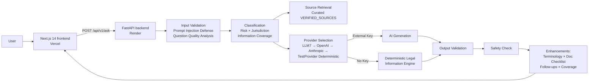

# LegalAI Access

**Structured, jurisdiction-aware legal information with transparent AI providers and a deterministic no-API fallback.** Built for the Hack2Skill PromptWars Virtual Challenge — *AI for Legal Assistance & Access*.

> **This platform provides general legal information only and does not constitute legal advice.** The information is AI-generated and may contain inaccuracies. For matters that could significantly affect your rights, liberty, or finances, consult a qualified attorney licensed in your jurisdiction. No attorney-client relationship is created by using this service.

## Overview

LegalAI Access takes a natural-language legal question and returns a **structured, risk-aware, jurisdiction-aware information packet** — summary, explanation, next steps, escalation guidance, limitations, sources (when a curated source exists), and a persistent disclaimer. It is deliberately built as a multi-step pipeline (classify → question-quality → retrieve → generate → validate → safety-check), not a single chatbot prompt.

The platform operates **without requiring an external AI API key**. When external providers are unavailable or rate-limited, it automatically falls back to the **Deterministic Legal Information Engine (TestProvider)**, producing structured legal responses from curated sources.

## Problem Statement

Access to legal information is a major barrier to justice. Many people cannot afford attorneys for routine questions, and public resources are fragmented, jargon-heavy, or jurisdiction-specific without clear guidance on risk and next steps.

## Solution

A production web application that:

1. Accepts natural-language legal questions (with optional jurisdiction and context)
2. Analyzes question quality and identifies missing information
3. Classifies request type (deadline inquiry, procedural guidance, rights explanation, etc.)
4. Assesses risk level (low / moderate / high / critical) from keyword and category rules
5. Detects or accepts jurisdiction
6. Assesses information coverage (High / Moderate / Limited)
7. Attaches **curated** legal sources when a match exists (and says so when none does)
8. Generates a structured response with disclaimers, uncertainty notes, and next steps
9. Explains why this response was generated
10. Provides document checklists and context-aware follow-up suggestions
11. Enforces safety checks (no fabricated citations, no definitive-outcome promises, high-risk escalation)
12. Collects optional user feedback (in-memory; not persisted across restarts)
13. Supports response export (Copy, Print, Download JSON)

## Key Features

- **Multi-step AI workflow** — classification → question quality → source retrieval → generation → output validation → safety gate → enhancements
- **Risk-aware responses** — critical/high-risk queries get a prominent escalation notice and mandatory uncertainty notes
- **Source transparency** — curated sources shown with citation, URL, and verification status; explicit "no verified source" state when none matches
- **Question Quality Analysis** — scores question completeness (0-100), identifies missing information, suggests improvements without blocking users
- **Information Coverage Assessment** — indicates High/Moderate/Limited coverage based on jurisdiction and source availability
- **Legal Terminology Explainer** — click-to-expand definitions for legal terms appearing in responses
- **Document Checklist** — contextual checklist of documents that may help each legal category
- **Follow-up Suggestions** — smart context-aware follow-up questions after each response
- **"Why This Response?"** — explains detected topic, response mode, source coverage, risk classification
- **Response Export** — Copy to clipboard, Print, and Download JSON (includes question, sources, next steps, disclaimer)
- **Privacy-First UX** — visible privacy notice near question input and in response area
- **Provider Status** — clearly labels whether Deterministic Legal Information Engine or AI Provider is active
- **Jurisdiction awareness** — US federal, CA/NY/TX, UK, Canada, Australia, EU, international (auto-detect fallback)
- **Prompt-injection defense** — pattern scanning with risk scoring; high-risk inputs are blocked with a structured security response
- **Responsible-AI disclaimers** — persistent banner, per-response disclaimer, footer notice
- **Accessible interface** — labelled controls, keyboard operable, focus indicators, live regions for loading/errors (see Accessibility)
- **Security hardening** — rate limiting, security headers, input size limits, no secrets in the frontend
- **Tested** — 75 backend tests, 33 frontend tests, 108 total, lint + type-check + production build

## Competition Quality Features

### Question Quality Analysis
Every question is scored for completeness (0-100). Questions with missing jurisdiction or insufficient detail flag what information would improve the response. Users are never blocked from continuing.

### Information Coverage
After processing, the system reports whether source coverage is **High** (federal + state), **Moderate** (federal), or **Limited** (jurisdiction not yet covered). This is based on actual source availability, not AI confidence.

### Legal Terminology Explainer
When legal terms appear in responses (e.g., "eviction", "retaliation", "wrongful termination"), users can click them to see a plain-language explanation.

### Document Checklist
Each legal category (housing, employment, consumer, etc.) shows a contextual checklist of documents that may help the user gather relevant evidence.

### Follow-up Suggestions
After each response, the system offers safe, context-aware follow-up questions that can be clicked to auto-populate the question field.

### "Why This Response?"
A dedicated section explains what the system detected (topic, signals), the response mode (deterministic engine vs. AI provider), source coverage, and risk classification — without exposing hidden chain-of-thought.

### Response Export
Users can **Copy** the response text, **Print** via browser, or **Download** a structured JSON file containing the question, jurisdiction, sources, next steps, disclaimer, and metadata.

### Privacy-First UX
A persistent privacy notice reminds users not to enter sensitive personal information and clarifies that questions are not saved as a permanent legal record.

### Provider Status
A clearly labeled indicator shows whether the system is operating in **Deterministic Legal Information Mode** (no API key needed) or with an active **AI Provider**.

## User Journey

1. Open the app → workspace (question form, jurisdiction selector, examples, status indicator) is visible
2. Type a legal question (optionally open **Additional Context**, pick a jurisdiction)
3. Submit (button or Ctrl+Enter) → loading state with live announcement
4. Receive structured response: metadata badges, answer, question quality check, information coverage, "Why This Response?", key points, risk level, jurisdiction, sources, document checklist, terminology, next steps, follow-up suggestions, escalation (if any), limitations, disclaimer
5. Optionally rate the response (feedback endpoint)
6. **Copy**, **Print**, or **Download JSON** the response
7. **Ask Another Question** or **Clear Form** to reset

Error paths (empty/short/oversized input, invalid jurisdiction, backend down, rate limit, blocked injection) show recoverable, accessible error UI — never stack traces.

## Architecture

Full diagram and component tables: **[docs/architecture.md](docs/architecture.md)** (Mermaid).



## AI Workflow

**Provider selection (external API keys are optional):**

- `LLM7_API_KEY` → LLM7.io free tier (GPT-4o-mini, 30 RPM, email signup)
- else `OPENAI_API_KEY` → OpenAI `gpt-4o-mini`
- else `ANTHROPIC_API_KEY` → Anthropic `claude-3-haiku`
- else **Deterministic Legal Information Engine (TestProvider)** — no API key needed

**Deterministic fallback:** When no usable external provider is available, `TestProvider` automatically provides structured legal responses from curated sources. It is **not** an LLM and is **not** "mock content" — it produces deterministic, rule-based legal information from verified source tables.

**Rule-based (not LLM):** request classification, risk assessment, jurisdiction detection, legal category, source selection, question quality analysis, clarification questions, prompt-injection scan, output validation, safety checks.

**Not used in the live path:** embeddings/vector search (embedding model name exists in settings but no retrieval call uses it), document processing, real-time legal data.

## Safety & Responsible AI

- Server-attached disclaimer on **every** response; persistent frontend banner
- High-risk keyword rules (arrest, eviction, domestic violence, deadlines, etc.) force escalation guidance + uncertainty notes — enforced by validator, not just prompted
- Definitive-outcome language ("you will win", "guaranteed") detected → modified or fallback
- Unauthorized-practice-of-law patterns detected → modified
- Fabrication heuristics flag statute/case-style citations not backed by provided sources
- High-risk situations (violence, arrest, imminent deadlines) get prominent UI escalation toward attorneys/legal aid/public defenders
- The product never claims to be a lawyer and states it provides information, not advice

## Security

- **Secrets:** AI and service keys are server-side only (Render env vars). Frontend bundle contains only `NEXT_PUBLIC_API_URL`. `.env` files are gitignored; `.env.example` has placeholders.
- **Rate limiting:** 30 requests/minute/IP (health checks exempt) with `Retry-After` and standard rate-limit headers
- **Input limits:** question ≤ 5000 chars, context ≤ 2000, body ≤ 1 MB
- **Headers:** CSP, `X-Frame-Options: DENY`, `X-Content-Type-Options`, `Referrer-Policy`, `Permissions-Policy`
- **CORS:** restricted allow-list including the production Vercel origin
- **Errors:** generic `{error, code}` responses; stack traces only in server logs
- **Prompt injection:** strict scan/sanitize/block before the LLM; response-side injection-artifact check as defense in depth

> **Security note:** A Render API token was previously present in the repository history. It has been removed from the current working tree. The credential should be considered compromised and rotated in the Render dashboard. No secrets are present in the current repository.

## Accessibility

Implemented (not a formal WCAG certification claim):

- Semantic structure: `header` / `main` / `footer`, labelled sections, heading hierarchy
- All form controls have associated labels; hints and errors wired via `aria-describedby` / `aria-invalid`
- Keyboard operable form (Ctrl+Enter submits), visible focus rings on controls
- Loading state announced (`aria-live`), errors use `role="alert"`, status badge updated
- Screen-reader-only live text for submit/loading status
- Dark-mode color variants on form surfaces
- Respects `prefers-reduced-motion` and `prefers-contrast: high` (CSS media queries)
- Responsive layout from ~375px to desktop

**Not claimed:** WCAG 2.1 AA compliance has not been verified by a formal audit or assistive-technology testing pass.

## Testing

### Backend (75 tests)
```bash
cd backend
python -m pytest -q
```
Covers health, ask happy path, validation, high-risk escalation, conversation IDs, feedback, question quality analysis, information coverage, terminology explanations, document checklists, follow-up suggestions, provider status, security headers, rate limiting, prompt injection defense, plus AI workflow, prompt defense, safety, and output validation behavior.

### Frontend (33 tests)
```bash
cd frontend
npm test
npm run lint
npm run type-check
npm run build
```
Covers the `useLegalAssistant` hook, `QuestionInput` validation and a11y attributes, and accessible component behavior.

**Total: 108 tests.** All passing. TypeScript check: PASS. Production build: PASS. Security: PASS. No-API mode: PASS. Provider fallback: PASS.

## Technology Stack

| Layer | Tech |
|-------|------|
| Frontend | Next.js 14 (App Router), React 18, TypeScript, Tailwind CSS 4 |
| Frontend tests | Jest, React Testing Library, jsdom |
| Backend | FastAPI, Pydantic v2, Uvicorn, Python 3.11+ |
| Backend tests | Pytest, pytest-asyncio, httpx (ASGI) |
| AI | LLM7.io free tier (GPT-4o-mini, optional) · OpenAI `gpt-4o-mini` (optional) · Anthropic `claude-3-haiku` (optional) · TestProvider (Deterministic Legal Information Engine, no API key required) |
| Hosting | Vercel (frontend), Render (backend), GitHub (source, Render auto-deploy) |

## Project Structure

```
PROJECT/
├── frontend/                 # Next.js app
│   ├── src/app/page.tsx      # Workspace UI
│   ├── src/components/       # Form, response, a11y, disclaimers, error UI
│   ├── src/hooks/            # useLegalAssistant
│   ├── src/lib/api.ts        # API client
│   └── src/types/            # Shared types
├── backend/                  # FastAPI app
│   ├── app/main.py           # App, CORS, middleware, error handlers
│   ├── app/api/              # Routes, rate-limit/security middleware
│   ├── app/models/           # Pydantic schemas
│   ├── app/services/         # AI workflow, safety, validation, LLM client, sources
│   └── app/tests/            # Pytest suite
├── docs/architecture.md      # Architecture diagram + component docs
├── .env.example              # Config template (no secrets)
└── README.md
```

## Environment Variables

Template: [.env.example](.env.example)

| Variable | Where | Required | Purpose |
|----------|-------|----------|---------|
| `OPENAI_API_KEY` | Render (backend) | Optional | Real LLM responses (fallback) |
| `ANTHROPIC_API_KEY` | Render (backend) | Optional | Real LLM responses (fallback) |
| `LLM7_API_KEY` | Render (backend) | Optional | LLM7.io free API key (no credit card) |
| `SECRET_KEY` | Render | Recommended | App secret (≥ 32 chars) |
| `BACKEND_CORS_ORIGINS` | Render | Yes | Allowed frontend origins |
| `RATE_LIMIT_REQUESTS` / `RATE_LIMIT_WINDOW_SECONDS` | Render | No | Defaults 30 / 60 |
| `LOG_LEVEL` | Render | No | Default `INFO` |
| `NEXT_PUBLIC_API_URL` | Vercel (frontend build) | Yes in prod | Backend base URL (public by design) |
| `RENDER_API_KEY` | local only (optional) | No | For `backend/check-deploy.ps1` helper |

**No API key is required.** When no external provider key is configured, the system automatically uses the **Deterministic Legal Information Engine (TestProvider)** to produce structured legal responses from curated source tables.

## Local Development

### Prerequisites
- Node.js 20+
- Python 3.11+
- External API keys are optional (OpenAI, Anthropic, or LLM7.io). Without any key, the Deterministic Legal Information Engine provides structured legal responses.

### Backend
```bash
cd backend
python -m venv .venv
# Windows: .venv\Scripts\activate   |   Unix: source .venv/bin/activate
pip install -r requirements.txt
copy ..\.env.example .env   # add your keys
uvicorn app.main:app --reload
```

### Frontend
```bash
cd frontend
npm install
# .env.local: NEXT_PUBLIC_API_URL=http://localhost:8000
npm run dev
```

Visit `http://localhost:3000` (UI) and `http://localhost:8000/docs` (OpenAPI).

## Deployment

- **Frontend:** Vercel — `https://frontend-mocha-six-92.vercel.app/`  
  Build with `NEXT_PUBLIC_API_URL=https://legalai-backend-6jio.onrender.com`
- **Backend:** Render web service via [`backend/render.yaml`](backend/render.yaml) — `uvicorn app.main:app`, health check `/api/v1/health`, auto-deploy on push to `main`
- **CI:** none configured in this repository (tests run locally/Manually)

## Assumptions

- English-only UI and responses
- Jurisdiction coverage limited to the configured enum; unknown → clarification question + general information
- Sources are a small **curated in-code table** (US Federal and California entries today), not a comprehensive legal database
- Conversation context lives in backend process memory only (lost on restart/deploy, not shared across instances)
- Feedback is stored in memory for demonstration only

## Limitations

1. **Not legal advice** — general information only
2. **AI-generated content** — may be inaccurate; verify with official sources
3. **Curated sources only** — no live legal research; many jurisdictions/categories have no matching source (UI states this honestly)
4. **No document upload**, no user accounts, no persistent sessions
5. **No real-time legal data** — model training-cutoff knowledge
6. **Deterministic Legal Information Mode** when no external provider key is available (structured legal responses from curated sources)
7. **Not formally audited** for WCAG 2.1 AA or independent security review
8. Rate limit is per-instance in-memory (resets on deploy; not distributed)

## Future Improvements

- [ ] Verified production LLM key management + provider observability
- [ ] Persistent, encrypted conversation history
- [ ] Broader source coverage / real legal-aid directory integrations
- [ ] Document upload and analysis
- [ ] Multi-language support
- [ ] Formal accessibility audit (AT testing) toward WCAG 2.1 AA
- [ ] Distributed rate limiting and session stores
- [ ] Admin view for feedback analysis

## Repository Hygiene

- `.gitignore` excludes `node_modules`, virtualenvs, `.env*`, build outputs, coverage, `*.tsbuildinfo`
- No secrets in the current tree (`.env.example` placeholders only)
- One branch (`main`); repository is under 10 MB
- Public GitHub repository
- Latest release commit includes: 75 backend tests, 33 frontend tests, full competition-quality pass

## License

MIT — see [LICENSE](LICENSE).

## Contributing

This is a hackathon submission. For any production use, independently security-audit the system, verify legal information with qualified attorneys, and add real data-retention/privacy controls.
