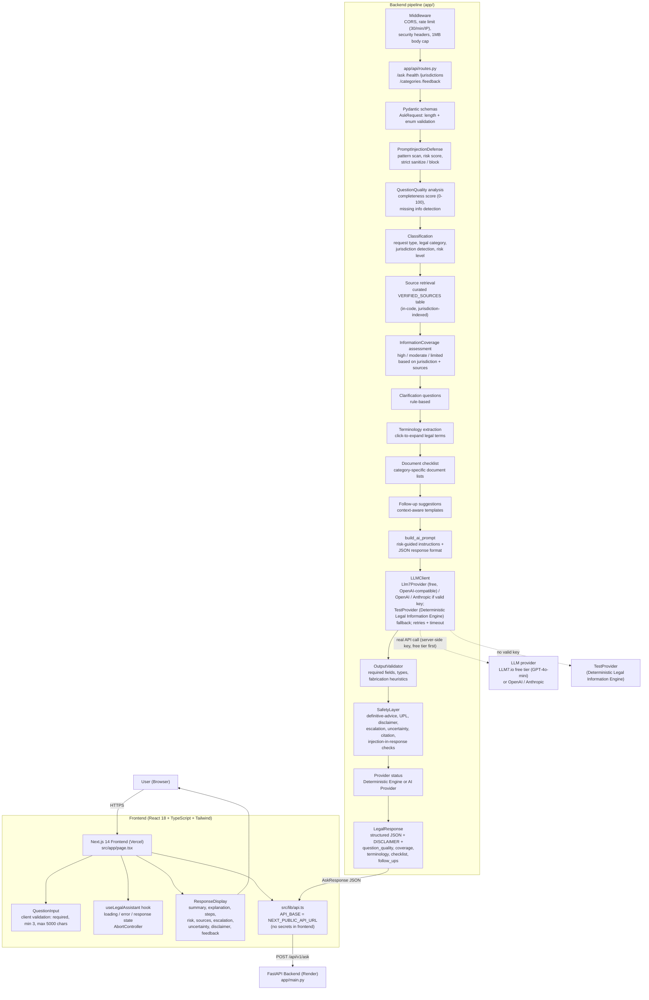

# LegalAI Access — Architecture

This document describes the **actual implemented** architecture of LegalAI Access as of the final production validation pass. It does not invent databases, vector stores, agents, or providers that are not part of the running system.

## System Overview

## Components

### Frontend

| Piece | Location | Role |
|-------|----------|------|
| Page / workspace | `frontend/src/app/page.tsx` | Workspace form vs. loading/error/response views, health badge, footer |
| Form | `frontend/src/components/QuestionInput.tsx` | Question, jurisdiction select, optional context, validation, examples |
| Response UI | `frontend/src/components/ResponseDisplay.tsx` | Structured sections incl. question quality, information coverage, why this response, document checklist, terminology explainer, next steps with checkboxes, follow-up suggestions, provider status, privacy notice, export actions |
| State hook | `frontend/src/hooks/useLegalAssistant.ts` | ask / clear / feedback, AbortController, error mapping |
| API client | `frontend/src/lib/api.ts` | `NEXT_PUBLIC_API_URL` base, `ApiError` mapping |
| Accessible primitives | `frontend/src/components/AccessibleComponents.tsx` | Labelled inputs, focus rings, hints/errors |
| Error boundary | `frontend/src/components/ErrorBoundary.class.tsx` | Fallback UI with retry (not currently wrapping the page — see note) |

**Note:** During root-cause work on the blank-workspace bug, the `<ErrorBoundary>` wrapper was removed from `page.tsx` and the workspace then rendered correctly. The wrapper has **not** been re-added, to protect the working UI. The ErrorBoundary implementation remains in the codebase for future use.

### Backend

| Piece | Location | Role |
|-------|----------|------|
| App + handlers | `backend/app/main.py` | CORS, middleware order, validation/500 handlers (no stack traces) |
| Routes | `backend/app/api/routes.py` | `/ask`, `/health`, `/jurisdictions`, `/categories`, `/feedback` |
| Schemas | `backend/app/models/schemas.py` | Pydantic `AskRequest`/`LegalResponse`, enums |
| Middleware | `backend/app/api/middleware.py` | Rate limit, security headers (CSP, XFO, etc.), 1MB body limit |
| Workflow | `backend/app/services/ai_workflow.py` | Orchestrates the full pipeline |
| Classification/rules | `backend/app/services/constants.py` | Risk keywords, patterns, curated sources, disclaimer, prompt builder |
| Prompt defense | `backend/app/services/prompt_defense.py` | Injection patterns, strict sanitize/block |
| LLM client | `backend/app/services/llm_client.py` | OpenAI / Anthropic / Mock providers, retry + timeout |
| Output validation | `backend/app/services/output_validator.py` | Schema + fabrication checks, fallback generation |
| Safety layer | `backend/app/services/safety.py` | Final response gate (allow/warn/modify/block/fallback) |
| Sources | `backend/app/services/source_verifier.py` | Authority scoring over the curated source table |
| Conversation (in-memory) | `backend/app/services/conversation.py` | Per-process conversation context (not persisted) |

## API Flow

1. `POST /api/v1/ask` with `{question, jurisdiction?, context?, conversation_id?}` (limits: question 1–5000 chars, context ≤ 2000).
2. Middleware: rate limit → security headers → body-size check.
3. Pydantic validation (422 with `VALIDATION_ERROR` on failure).
4. Prompt-injection scan; high risk-score (> 0.7) → blocked structured response.
5. Classification: request type, legal category, jurisdiction (explicit or detected), risk level (keyword rules).
6. Source retrieval from the curated in-code table (US federal/CA only entries exist today; others get none and the UI says so).
7. Rule-based clarification questions.
8. Prompt built with risk-specific guidance; sent to `LLMClient` as JSON-mode chat completion.
9. Output validated (required fields, types, fabrication heuristics). Invalid → safe fallback text.
10. Safety gate (definitive advice, UPL, disclaimer, escalation/uncertainty for high risk, citation checks, injection artifacts). May modify / fallback / block.
11. Returns `AskResponse {response, conversation_id}` with server-attached `DISCLAIMER`.

## AI Workflow (what actually invokes AI)

- **Free LLM provider (production default):** LLM7.io � OpenAI-compatible, GPT-4o-mini on free tier, 30 RPM, email signup only, no credit card required
- **Invoked by LLM (when a valid key is configured server-side):** free-text explanation/summary generation only (`gpt-4o-mini` or `claude-3-haiku`, JSON mode, temperature 0.1).
- **Rule-based (not LLM):** request classification, risk level, jurisdiction detection, legal category, source selection, clarification questions, safety checks, output validation.
- **No embeddings are invoked in the running pipeline** despite an embedding model name appearing in settings; source retrieval is a curated table lookup, not vector search.
- **TestProvider (Deterministic Legal Information Engine) fallback:** if no valid `OPENAI_API_KEY`/`ANTHROPIC_API_KEY` is present (missing, placeholder `test-` prefix, or ≤ 20 chars), responses are explicitly labeled mock text.

## Validation

- Frontend: required question, min 3 chars, max 5000; jurisdiction optional.
- Backend: Pydantic min/max/enum; second min-3 check in workflow.
- Output: required JSON fields, type checks, fabrication pattern warnings, risk-appropriate escalation/uncertainty enforcement.

## Safety Controls

- **Prompt injection:** pattern detection with risk score; strict mode replaces/removes matched content; score > 0.7 blocks with a structured "security policy" response.
- **Not-legal-advice:** server-attached disclaimer on every response; persistent frontend banner; footer notice.
- **High-risk escalation:** keyword-driven risk levels; CRITICAL/HIGH get mandatory escalation guidance and uncertainty notes (enforced by output validator + safety layer).
- **UPL / definitive language:** detection patterns; modify or fallback.
- **Fabricated citations:** pattern heuristics flag citations without backing sources; curated sources only are ever attached.
- **Secrets:** AI keys are server-side only (Render env); frontend only has `NEXT_PUBLIC_API_URL`.

## Retrieval

Curated `VERIFIED_SOURCES` table in `constants.py` (currently: US Federal — Fair Housing Act, FMLA, ADA; California — Tenant Protection Act, Courts Self-Help). Domain-based authority scoring in `source_verifier.py`. **No live legal database, no vector store, no real-time feeds.** When no source matches, the UI states that explicitly.

## External Services

| Service | Use |
|---------|-----|
| LLM7.io free tier (GPT-4o-mini, OpenAI-compatible) / OpenAI API *or* Anthropic API | Chat completion (only when a valid key is configured) |
| Vercel | Frontend hosting |
| Render | Backend hosting (`uvicorn`), health check `/api/v1/health` |
| GitHub | Source of truth; Render auto-deploys from `main` |

## Error Handling

- Backend: 422 validation (JSON-serializable details), 400 invalid jurisdiction (route-level), 429 rate limit with `Retry-After`, 500 generic `{error, code}` with **no stack traces or internal details** (logged server-side only).
- LLM failure/timeout/bad JSON → safe fallback response text (still disclaimer + escalation when high-risk).
- Frontend: `ApiError` mapping, inline `role="alert"` messages, rate-limit countdown hint, retry button; ErrorBoundary available but not currently mounted (see note above).

## Deployment Architecture

- **Frontend:** Vercel project → `https://frontend-mocha-six-92.vercel.app/`, built with `NEXT_PUBLIC_API_URL=https://legalai-backend-6jio.onrender.com` baked into the client bundle.
- **Backend:** Render web service (`render.yaml`), Python 3.11, `uvicorn app.main:app`, auto-deploy on push to `main`, health check `/api/v1/health`.
- **CORS:** allow-list includes the Vercel origin (set in `main.py` / `BACKEND_CORS_ORIGINS`).

## Known Non-Features (explicitly not implemented)

- No database / no persistent sessions (conversation state is in-process only).
- No document upload or processing.
- No vector database or embedding-based retrieval in the live path.
- No real-time legal data feeds.
- No user accounts.
